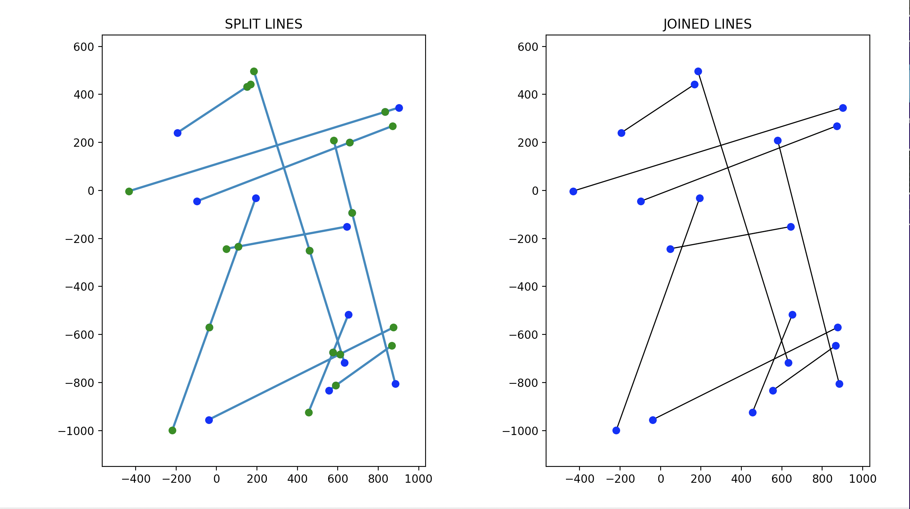
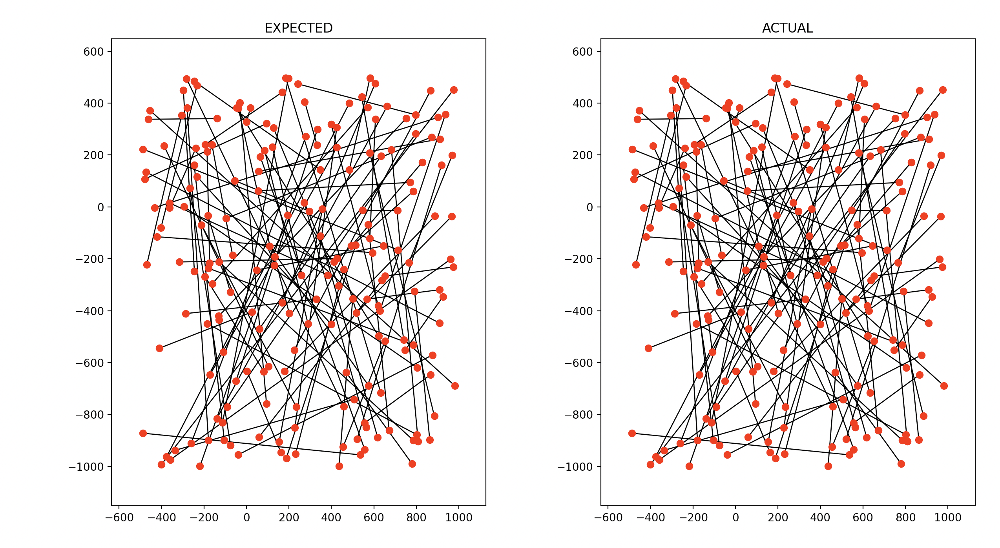

# Line Merger
The premise of this project is that you are given, by JSON file, a list of lines that may or may not be connected at one coordinate and have the same slope. The task at hand is to take this list of lines, find all the lines that can be "merged" into one bigger line, and return the list of those merged lines

When working on this, I soon realized how helpful it would be to visualize the input and output, as so we can quickly confirm the legitimacy of what we process, instead of looking at just a list of raw coordinates. 

This first example here illustrates a small demo version of this problem, in the graph on the left, each pair of dots represents a distinct line, and for the sake of example, each line has a corresponding line it can merge with. The graph on the left represents the result of merging all the lines

The graph on the left represents the expected output after merging all the lines given in test/assets/1-split.json and the graph on the right represents the output of processing the input through the line merger. This is by no means conclusive evidence the merger works, but it does give us a quick thumbs up that we're roughly in the right ballpark. 

